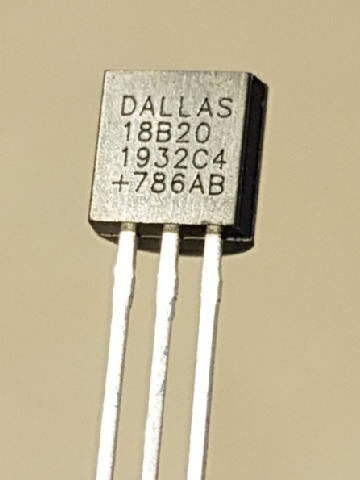

# Your DS18B20 temperature sensor is likely a fake, counterfeit, clone...
...unless you bought the chips directly from [Maxim Integrated](https://www.maximintegrated.com/en/products/sensors/DS18B20.html) (or Dallas Semiconductor in the old days) or an authorized distributor (DigiKey, RS, Farnell, Mouser, Conrad, etc.), or you took exceptionally good care purchasing waterproofed DS18B20 probes. We bought over 500 "waterproof" probes from two dozen sellers on ebay. All of them contained counterfeit DS18B20 sensors. Also, almost all sensors we bought on ebay were counterfeit.

> Author: Chris Petrich, 18 November 2019.
> License: CC BY.
> Source: https://github.com/cpetrich/counterfeit_DS18B20/

## Why should I care?
Besides ethical concerns, some of the counterfeit sensors actually do not contain an EEPROM, do not work in parasitic power mode, have a high noise level or temperature offset outside the advertised ±0.5 °C band, have bugs and unspecified failure rates, or differ in another unknown manner from the specifications in the Maxim datasheet. Clearly, the problems are not big enough to discourage people from buying probes on ebay, but it may be good to know the actual specs when the data are important or measurement conditions are difficult.

## Are they clones?
IMHO, they are not clones, they are counterfeits (fakes). They are not clones because, as of writing (2019), all counterfeits behave differently electrically from the authentic Maxim products and can be distinguished easily from the originals. The manufacturers of the counterfeits have not attempted to disguise their counterfeit nature electrically, and even use topmarks with production date--batch code combinations different from the ones used by Maxim. However, I consider them counterfeits because their topmarks wrongly implies they were produced by ``Dallas`` (i.e., a shorthand for a company bought by Maxim).

## What do they look like?

Above is an example of an **authentic**, Maxim-produced DS18B20 sensor in TO-92 case. 
* As of writing (2019), the topmark of original Maxim chips is lasered rather than printed. 
* The first two rows, ``DALLAS 18B20``, specify that this part is a DS18B20 (Dallas Semiconductor being the original producer),
* the ``+`` in the 4th row indicates that the part is RoHS compliant (\[1\]). 
* The 3rd row specifies production year and week number of the year (in this case, week 32 of 2019), and 
* the last two characters in row 3 specify the revision of the die (``C4`` since at least late 2011). 
* In row 4, the three-digit number followed by two characters are a form of batch code that allows Maxim to trace back the production history. From what I can tell, for a given character combination the number in the batch code increases as the date code increases albeit in non-obvious increments. Since 2016, I've only come across character combinations ``AB`` and ``AC``. In earlier chips I've seen ``AD`` and ``AI``.

The **counterfeit** DS18B20 I've come across in 2019 have the following notable features: 
* The topmark is printed rather that lasered,
* In row 3, the date code increases with time, i.e. it may actually be accurate. The die code is ``C4`` (2019).
* The 4th row is rather independent of the date code and reads (list is likely incomplete)
	+ Family B: ``+233AA`` or ``+887AB``
	+ Family C: ``+158AC``
	+ Family D: ``+051AG``

Note that manufacturing processes may change over time. The above is valid as of 2019.

## How do I know if I am affected?
If the DS18B20 have been bought from authorized dealers though a controlled supply chain then the chips are legit.

Otherwise, (I) one can test for compliance with the datasheet. If a sensor fails any of those tests, it is a fake (unless Maxim's implementation is buggy \[4\]). (II) one can compare sensor behavior with the behavior of Maxim-produced DS18B20. Those tests are based on the conjecture that all Maxim-produced DS18B20 behave alike. This should be the case at least for sensors that share a die code (which has been ``C4`` since at least some time in 2011 \[5\]) \[5\].

Regarding (I), discrepancy between what the current datasheet says should happen and what the sensors do include \[1,5\]
* Family C: the sensor is fixed in 12-bit mode (i.e., byte 4 of the scratchpad register is always ``0x7f``)
* Family C: the number of EEPROM write cycles is very small (order of 10 rather than >50k)
* Family B2, D: significant number of sensors with offsets outside the ±0.5 C range at 0 °C
* Family D: sensor does not respond in parasitic mode
* Family D: the temperature reading right after power-up is 25 rather than 85 °C
* Family D: sensor performs 12-bit conversion regardless of resolution setting
* Family D, E: reserved bytes 5 and 7 of the scratchpad register are not ``0xff`` and ``0x10``, respectively
* Family D2, E: does not have an EEPROM

Hence, one will need to use heuristics (II) to detect fakes of Family B.

Regarding (II), there are simple tests for differences with Maxim-produced DS18B20 sensors (``C4`` die) that apparently *all* counterfeit sensors fail \[5\]. The most straight-forward software tests are probably these:
1. It is a fake if its ROM address does not follow the pattern 28-xx-xx-xx-xx-00-00-xx \[5\]. (Maxim's ROM is essentially a mostly chronological serial number (mostly, but not strictly when compared with the date code on the case) \[5\].)
2. It is a fake if ``<byte 6> == 0`` or ``<byte 6> > 0x10`` in the scratchpad register, or if the following scratchpad register relationship applies after **any** *successful* temperature conversion: ``(<byte 0> + <byte 6>) & 0x0f != 0`` (*12-bit mode*) \[3,5\].
3. It is a fake if the chip returns data to simple queries of undocumented function codes other than 0x68 and 0x93 \[4,5\]. (*As of writing (2019), this can actually be simplified to: it is a fake if the return value to sending code 0x68 is ``0xff`` \[5\].*)

In addition to obvious implementation differences such as those listed above under (I) and (II), there are also side-channel data that can be used to separate implementations. For example, the time reported for a 12 bit-temperature conversion (as determined by polling for completion after function code 0x44 at room temperature) is characteristic for individual chips (reproducible to much better than 1% at constant temperature) and falls within distinct ranges determined by the circuit's internals \[5\]:
* 11 ms: Family D1
* 28-30 ms: Family C
* 460-525 ms: Family D2
* 580-615 ms: Family A
* 585-730 ms: Family B

Hence, there will be some edge cases between Families A and B, but simply measuring the time used for temperature conversion will often be sufficient to determine if a sensor is counterfeit.

Alternatively,
* It is a fake if the date--batch combination printed on the case of the sensor is not in the Maxim database (need to ask Maxim tech support to find out).

Note that none of the points above give certainty that a particular DS18B20 is an authentic Maxim product, but if any of the tests above indicate "fake" then it is most defintely counterfeit \[5\]. Based on my experience, a sensor that will fail any of the three software tests will fail all of them.

## What families of DS18B20-like chips can I expect to encounter?
Besides the DS18B20 originally produced by Dallas Semiconductor and continued by Maxim Integrated after they purchased Dallas (Family A, below), similar circuits seem to be produced independently by at least 4 other companies (Families B, C, D, and E) \[5\]. The separation into families is based on patterns in undocumented function codes that the chips respond to as similarities at that level are unlikely to be coincidental \[5\].

In our ebay purchases in 2018/19 of waterproof DS18B20 probes from China, Germany, and the UK, most lots had sensors of Family B1 (i.e., seems ok at first glance, but this is not an endorsement), while one in three purchases had sensors of Family D (i.e., garbage for our purposes). None had sensors of Family A. Neither origin nor price were indicators of sensor Family.

In the ROM patterns below, *tt* and *ss* stand for fast-changing and slow-changing values within a production run \[5\], and *crc* is the CRC8 checksum defined in the datasheet \[1\].

### Family A: Authentic Maxim DS18B20
* ROM pattern \[5\]: 28-tt-tt-ss-ss-00-00-crc
* Scratchpad register:  ``(<byte 0> + <byte 6>) & 0x0f == 0`` after all successful temperature conversions, and ``0x00 < <byte 6> <= 0x10`` \[2,3,5\].
* According to current behavior \[5\] and early datasheets \[9\], the power-up state of reserved ``<byte 6>`` in the Scratchpad register is ``0x0c``.
* Returns "Trim1" and "Trim2" values if queried with function codes 0x93 and 0x68, respectively \[4\]. The bit patterns are very similar to each other within a production run \[4\]. Trim2 is currently less likely to equal 0xff than Trim1 \[5\]. Trim2 was 0xDB or 0xDC since at least 2011, and has been 0x74 since late 2016 or early 2017 (all with ``C4`` die) \[5\].
	+ Trim1 and Trim2 encode two parameters \[5\]. Let the bit pattern of Trim1 be ``[t17, t16, t15, t14, t13, t12, t11, t10]`` (MSB to LSB) and Trim2 be ``[t27, t26, t25, t24, t23, t22, t21, t20]``. Then,
		- offset parameter = ``[t22, t21, t20, t10, t11, t12, t13, t14, t15, t16, t17]`` (unsigned 11 bit-value) \[5\], and
		- curve parameter = ``[t27, t26, t25, t24, t23]`` (unsigned 5 bit-value) \[5\].
	+ Within a batch, the offset parameter seems to spread over 20 to 30 units while all sensors within the batch share the same curve parameter \[5\].
	+ The offset parameter shifts the temperature output over a range of approx. 100 °C (0.053 °C per unit), while the curve parameter shifts the temperature over a range of 3.88 °C (0.12 °C per unit), at least in current versions of the chip \[5\]. Example values of 2019 are ``offset = 0x420`` and ``curve = 0x0E``, i.e. they lie pretty central within their respective ranges.
* Temperature offset of current batches (2019) is as shown on the [Maxim FAQ](https://www.maximintegrated.com/en/support/faqs/ds18b20-faq.html) page, i.e. approx. +0.1 °C at 0 °C \[6\] (*i.e., not as shown on the datasheet \[1,9\]. The plot on the datasheet stems from measurements at the time of introduction of the sensor 10+ years ago \[5,10\].*). Very little if any temperature discretization noise \[5\].
* Polling after function code 0x44 indicates a spread of 584-615 ms between sensors for a 12-bit temperature conversion at room temperature \[5\]. Conversion time is easily repeatable for individual chips. Lower resolutions cut the time in proportion, i.e. 11 bit-conversions take half the time.
* It appears the chip returns a temperature of 127.94 °C (=0x07FF / 16.0) if a temperature conversion was unsuccessful \[5\] (e.g. due to power stability issues which arise reproducibly in "parasitic power" mode with *multiple* DS18B20 if Vcc is left floating rather than tied to ground. Note that the datasheet clearly states that Vcc is to be tied to GND in parasitic mode.).

- Example ROM: 28-13-9B-BB-0B **-00-00-** 1F
- Initial Scratchpad: **50**/**05**/4B/46/**7F**/**FF**/0C/**10**/1C
- Example topmark: DALLAS DS18B20 1932C4 +786AB

### Family B1: Matches Datasheet Temperature Offset Curve
* ROM patterns \[5\]:
	- 28-AA-tt-ss-ss-ss-ss-crc
	- 28-tt-tt-ss-ss-ss-ss-crc
* Scratchpad register ``<byte 6>`` is constant (default ``0x0c``) \[5\].
* Write scratchpad-bug (0x4E) \[5\]:
	- If 3 data bytes are sent (TH, TL, Config) then ``<byte 6>`` changes to the third byte sent,
	- 5 data bytes can be sent with function code 0x4E, where the last two bytes overwrite ``<byte 6>`` and ``<byte 7>``, respectively.
* Does not return data on undocumented function code 0x68 \[5\]. Does return data from codes 0x90, 0x91, 0x92, 0x93, 0x95, and 0x97 \[5\]. Return value in response to 0x97 is ``0x22`` \[5\].
* ROM code can be changed in software with command sequence "96-Cx-Dx-94" \[5\].
* Temperature offset as shown on the datasheet (-0.15 °C at 0 °C) \[6\]. Very little if any temperature discretization noise \[5\].
* Polling after function code 0x44 indicates approx. 589-728 ms for a 12-bit temperature conversion and proportionally less at lower resolution \[5\].

- Example ROM: 28 **-AA-** 3C-61-55-14-01-F0
- Example ROM: 28-AB-9C-B1 **-33-14-01-** 81
- Initial Scratchpad: 50/05/4B/46/7F/FF/0C/10/1C
- Example topmark: DALLAS DS18B20 1626C4 +233AA

### Family B2: -0.5 °C Temperature Offset at 0 °C
* ROM patterns \[5\]: 28-FF-tt-ss-ss-ss-ss-crc
* Scratchpad register ``<byte 6>`` is constant (default ``0x0c``) \[5\].
* Write scratchpad-bug (0x4E) \[5\]:
	- If 3 data bytes are sent (TH, TL, Config) then ``<byte 6>`` changes to the third byte sent,
	- 5 data bytes can be sent with function code 0x4E, where the last two bytes overwrite ``<byte 6>`` and ``<byte 7>``, respectively.
``<byte 7>``, respectively.
* Does not return data on undocumented function code 0x68 \[5\]. Does return data from codes 0x90, 0x91, 0x92, 0x93, 0x95, and 0x97 \[5\]. Return value in response to 0x97 is ``0x31`` \[5\].
* ROM code can **not** be changed in software with command sequence "96-Cx-Dx-94" \[5\].
* Typical temperature offset at at 0 °C is -0.5 °C \[6\]. Very little if any temperature discretization noise \[5\].
* Polling after function code 0x44 indicates approx. 587-654 ms for a 12-bit temperature conversion and proportionally less at lower resolution \[5\].

- Example ROM: 28 **-FF-** 7C-5A-61-16-04-EE
- Initial Scratchpad: 50/05/4B/46/7F/FF/0C/10/1C
- Example topmark: DALLAS DS18B20 1626C4 +233AA

### Family C: Small Offset at 0 °C
* ROM patterns \[5\]: 28-FF-64-ss-ss-tt-tt-crc
* Scratchpad register ``<byte 6> == 0x0c`` \[5\].
* Does not return data on undocumented function code 0x68 or any other undocumented function code \[5\].
* Typical temperature offset at 0 °C is +0.05 °C \[6\]. Very little if any temperature discretization noise \[5\].
* EEPROM endures only about eight (8) write cycles (function code 0x48) \[5\].
* Polling after function code 0x44 indicates 28-30 ms (thirty) for a 12-bit temperature conversion \[5\]. Temperature conversion works also in parasite power mode \[5\].
* Operates in 12-bit conversion mode, only (configuration byte reads ``0x7f`` always) \[5\].
* Default alarm register settings differ from Family A (``0x55`` and ``0x00``) \[5\].
* *Note, not to be confused: there were chips with ROM pattern 28-61-64-ss-ss-tt-tt-crc and batch code ``+158AC`` that do not work in parasite mode and have a scratchpad register like Family E.*

- Example ROM: 28 **-FF-64-** 1D-CD-96-F2-01
- Initial Scratchpad: 50/05/55/00/7F/FF/0C/10/21
- Example topmark: DALLAS DS18B20 1810C4 +158AC

### Family D1: Noisy Rubbish with Supercap
* ROM patterns \[5\]: 28-tt-tt-77-91-ss-ss-crc and 28-tt-tt-46-92-ss-ss-crc
* Scratchpad register ``<byte 7> == 0x66``, ``<byte 6> != 0x0c`` and ``<byte 5> != 0xff`` \[5\].
* Does not return data on undocumented function code 0x68 \[5\]. Responds back with data or status information after codes 
	+ 0x4D, 0x8B (8 bytes), 0xBA, 0xBB, 0xDD (5 bytes), 0xEE (5 bytes) \[5\], or
	+ 0x4D, 0x8B (8 bytes), 0xBA, 0xBB \[5\].
* First byte following undocumented function code 0x8B is ``0x06`` \[5\].
* It is possible to send arbitrary content for ROM code and for bytes 5, 6, and 7 of the status register after undocumented function codes 0xA3 and 0x66, respectively \[5\].
* Temperature errors up to 3 °C at 0 °C \[6\]. Very noisy data \[5\].
* Sensors **do not work with Parasitic Power**. Sensors leave data line floating when powered parasitically \[5\].
* Polling after function code 0x44 indicates approx. 11 ms (eleven) for conversion regardless of measurement resolution \[5\].
* Chips **contain a supercap rather than an EEPROM** to hold alarm and configuration settings \[5\]. I.e., the last temperature measurement and updates to the alarm registers are retained between power cycles that are not too long \[5\].
	+ The supercap retains memory for several minutes unless Vcc is pulled to GND, in which case memory retention is 5 to 30 seconds \[5\].
* Initial temperature reading is 25 °C or the last reading before power-down \[5\]. Default alarm register settings differ from Family A (``0x55`` and ``0x05``) \[5\].

- Example ROM: 28-24-1D-77 **-91-** 04-02-CE  (responds to 0xDD and 0xEE)
- Example ROM: 28-B8-0E-77 **-91-** 0E-02-D7
- Example ROM: 28-21-6D-46 **-92-** 0A-02-B7
- Initial Scratchpad: 90/01/55/05/7F/7E/81/66/27
- Example topmark: DALLAS DS18B20 1827C4 +051AG

### Family D2: Noisy Rubbish
* ROM patterns \[5\]: 28-tt-tt-79-97-ss-ss-crc, 28-tt-tt-94-97-ss-ss-crc, 28-tt-tt-79-A2-ss-ss-crc
* Scratchpad register ``<byte 7> == 0x66``, ``<byte 6> != 0x0c`` and ``<byte 5> != 0xff`` \[5\].
* Does not return data on undocumented function code 0x68 \[5\]. Responds back with data or status information after codes 
	+ 0x4D, 0x8B (9 bytes), 0xBA, 0xBB, 0xDD (3 bytes), 0xEE (3 bytes) \[5\], or
	+ 0x4D, 0x8B (9 bytes), 0xBA, 0xBB \[5\].
* First byte following undocumented function code 0x8B is ``0x00`` \[5\].
* Temperature errors up to 3 °C at 0 °C \[6\]. Data noisier than genuie chips \[5\].
* Sensors **do not work with Parasitic Power**. Sensors draw data line low while powered parasitically \[5\].
* Polling after function code 0x44 indicates approx. 462-523 ms for conversion regardless of measurement resolution \[5\]. The series with ``97`` and ``A2`` in the ROM converts in 494-523 ms and 462-486 ms, respectively \[5\].
* Initial temperature reading is 25 °C \[5\]. Default alarm register settings differ from Family A (``0x55`` and ``0x05``) \[5\].

- Example ROM: 28-90-FE-79 **-97-** 00-03-20
- Example ROM: 28-FD-58-94 **-97-** 14-03-05
- Example ROM: 28-FB-10-79 **-A2-** 00-03-88
- Initial Scratchpad: 90/01/55/05/7F/xx/xx/66/xx
- Example topmark: DALLAS DS18B20 1827C4 +051AG

### Family E: Incomplete Work
* ROM patterns \[5,7\]: 28-tt-tt-ss-ss-00-80-crc
* Scratchpad register ``<byte 7> == 0xff``, ``<byte 6> == 0xff`` \[5,7\].
* Contains no EEPROM \[7\].

- Example ROM: 28-9E-9C-1F **-00-00-80-** 04
- Initial Scratchpad: xx/xx/FF/FF/7F/FF/FF/FF/xx

## MAX31820
The MAX31820 appears to be a DS18B20 with limited supply voltage range (i.e. up to 3.7 V) and smaller temperature range of high accuracy \[1,8\]. Like the DS18B20, it uses one-wire family code 0x28 \[1,8\]. Preliminary investigations have not (yet) revealed a test to distinguish between DS18B20 of Family A and Maxim-produced MAX31820 in software \[5\].

## Warning
**Sending undocumented function codes to a DS18B20 sensor may render it permanently useless,** for example if temperature calibration coefficients are overwritten \[5\]. The recommended (and currently sufficient) way of identifying counterfeit sensors is to analyze state and behavior of the scratchpad register in response to commands that comply with the datasheet \[5\].

(*Information on chips of Families A, B, C, and D comes from my own investigations of sensors in conjunction with the references below as indicated by reference number \[1-6,8-10\]. Information on chips of Family E comes from web searches \[7\]. Tests were performed at 5 V with 1.2 kOhm pull-up.*)

## References

1. [DS18B20](https://datasheets.maximintegrated.com/en/ds/DS18B20.pdf) "DS18B20 Programmable Resolution 1-Wire Digital Thermometer", Datasheet 19-7487 Rev 6 7/19, Maxim Integrated.
2. [DS18S20](https://datasheets.maximintegrated.com/en/ds/DS18S20.pdf) "DS18S20 High-Precision 1-Wire Digital Thermometer", Datasheet, Maxim Integrated.
3. [AN4377](https://www.maximintegrated.com/en/design/technical-documents/app-notes/4/4377.html) "Comparison of the DS18B20 and DS18S20 1-Wire Digital Thermometers", Maxim Integrated
4. AN247 "DS18x20 EEPROM Corruption Issue", Maxim Integrated
5. Own investigations 2019, unpublished.
6. Petrich, C., M. O'Sadnick, Ø. Kleven, I. Sæther (2019). A low-cost coastal buoy for ice and metocean measurements. In Proceedings of the 25th International Conference on Port and Ocean Engineering under Arctic Conditions (POAC), Delft, The Netherlands, 9-13 June 2019, 6 pp.
7. Contribution of user *m_elias* on https://forum.arduino.cc/index.php?topic=544145.15
8. [MAX31820](https://datasheets.maximintegrated.com/en/ds/MAX31820.pdf) "1-Wire Ambient Temperature Sensor", Datasheet, Maxim Integrated.
9. DS18B20 "DS18B20 Programmable Resolution 1-Wire Digital Thermometer", Datasheet 043001, Dallas Semiconductor, 20pp.
10. DS18B20 "DS18B20 Programmable Resolution 1-Wire Digital Thermometer", Preliminary Datasheet 050400, Dallas Semiconductor, 27pp.
