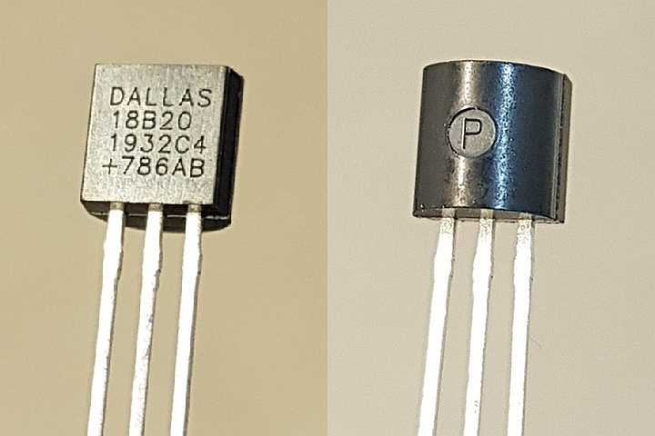
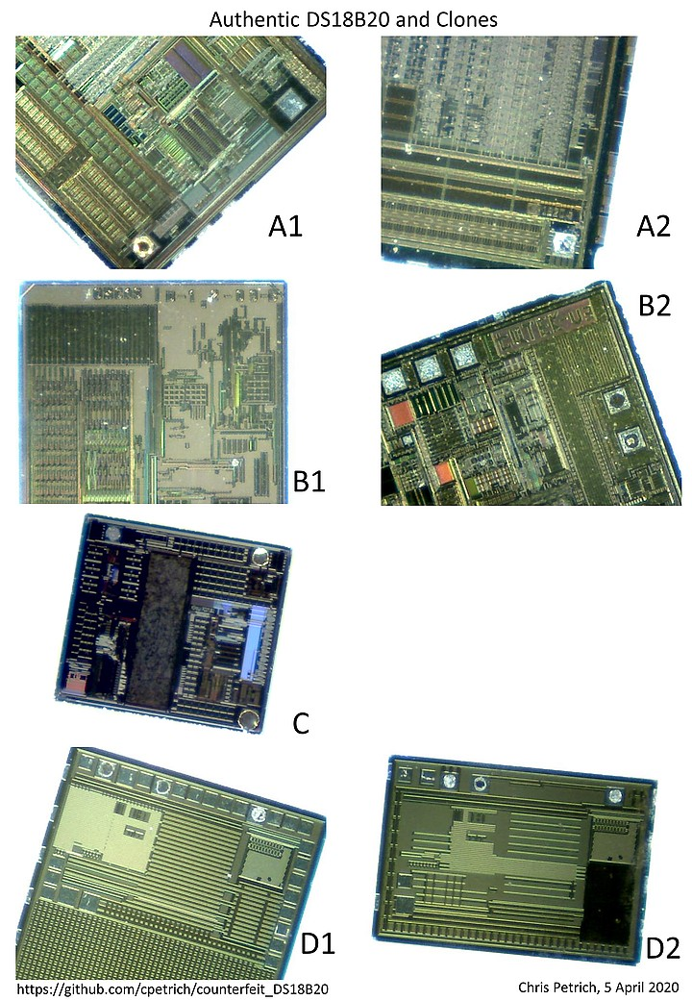
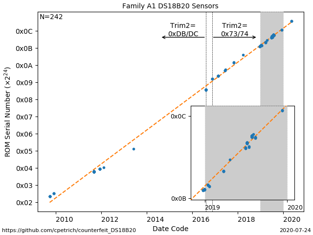
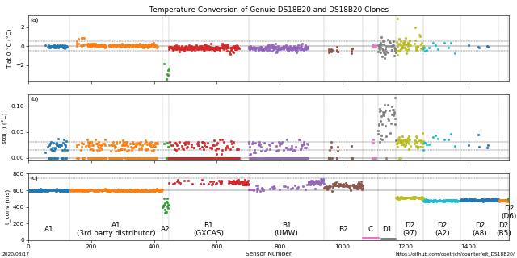

# Your DS18B20 temperature sensor is likely a fake, counterfeit, clone...
...unless you bought the chips directly from [Maxim Integrated](https://www.maximintegrated.com/en/products/sensors/DS18B20.html) (or Dallas Semiconductor in the old days), an [authorized distributor](https://www.maximintegrated.com/en/aboutus/contact-us/distributor-offices.html) (DigiKey, RS, Farnell, Mouser, etc.), or a big retailer, or you took exceptionally good care purchasing waterproofed DS18B20 probes. We bought over 1000 "waterproof" probes or bare chips from more than 70 different vendors on ebay, AliExpress, and online stores -big and small- in 2019. All of the probes bought on ebay and AliExpress contained counterfeit DS18B20 sensors, and almost all sensors bought on those two sites were counterfeit.

> Author: Chris Petrich, 22 Dec 2020.
> License: CC BY.
> Source: https://github.com/cpetrich/counterfeit_DS18B20/

(Sensor information based on sensors or probes ordered well into 2020 rather than in or around 2019 are marked "*(2020)*".)

## TLDR; How do I know?
If the ROM does not follow the pattern 28-xx-xx-xx-xx-00-00-xx then the DS18B20 sensor is a clone \[5\].

Also, there are two Arduino sketches provided to test DS18B20 sensors:
* ``discover_fake_DS18B20.ino`` performs some harmless tests and indicates if they show deviations from authentic DS18B20. Not designed to work with parasitic power.
* ``classify_fake_DS18B20.ino`` is a minimal implementation matching a sensor to a specific Family (see below) based on the response to undocumented function codes. Output is specific but rather boring. Use at your own risk.

## Why should I care?
Besides ethical concerns, some of the counterfeit sensors actually do not work in parasitic power mode, have a high noise level, temperature offset outside the advertised ±0.5 °C band, do not contain an EEPROM, have bugs and unspecified failure rates, or differ in another unknown manner from the specifications in the Maxim datasheet. Clearly, the problems are not big enough to discourage people from buying probes on ebay, but it may be good to know the actual specs when the data are important or measurement conditions are difficult.

## What are we dealing with?
Definitions differ, but following AIR6273, a **counterfeit** is an unauthorized copy, imitation, substitute, or modification misrepresented as a specific genuine item from an authorized manufacturer \[13\]. As of 2019, the main problem is imitations (**clones**) that are labeled to mislead the unsuspecting buyer. Fortunately, DS18B20 clones are nearly trivially easy to identify: Marking on the chip printed rather than lasered? No mark in the rear indent? Probably a conterfeit. Content of the "scratchpad register" doesn't comply with the datasheet? Probably a counterfeit. Behaves systematically different from known authentic chips? Probably a counterfeit.

## What do they look like?

Above is an example of an **authentic**, Maxim-produced DS18B20 sensor in TO-92 case. 
* As of writing (2019), the topmark of original Maxim chips is lasered rather than printed. 
* The first two rows, ``DALLAS 18B20``, specify that this part is a DS18B20 (Dallas Semiconductor being the original producer), parasitic power-only chips bear the maring ``DALLAS 18B20P``.
* The ``+`` in the 4th row indicates that the part is RoHS compliant (\[1\]). 
* The 3rd row specifies production year and week number of the year (in this case, week 32 of 2019), and 
* the last two characters in row 3 specify the revision of the die (currently ``C4``). 
* In row 4, the three-digit number followed by two characters are a form of batch code that allows Maxim to trace back the production history. 
	+ In chips produced 2016 or later I've only come across character combinations ``AB`` and ``AC`` \[5\].
* The marking inside the indent on the rear of the case is
	+ ``P`` (Philippines?) on all chips 2016 through 2019, on most chips in 2020 *(2020)*, and on most(?) chips going back at least as far as 2009 \[5\].
	+ ``THAI <letter>`` (Thailand?) where ``<letter>`` is one of ``I``, ``J``, ``K``, ``L``, ``M``, ``N``, ``O``, ``S``, ``T``, ``U``, ``V``, ``W``, ``X`` and possibly others, at least on some chips produced in 2011 \[5\]. The ``<letter>`` uses a different font than the letters making up ``THAI``.
	+ possibly additional markings or no markings on some chips since 2020 (cf. Issue [21](https://github.com/cpetrich/counterfeit_DS18B20/issues/21), Issue [22](https://github.com/cpetrich/counterfeit_DS18B20/issues/22)) *(2020)*
* From what I've seen on the TO-92 package, there is exactly one batch code associated with a date code for chips marked ``P`` in the indent \[5\]. This does not hold true for chips marked ``THAI`` in the indent \[5\].

*To avoid confusion: the relevant Maxim part number of the chips investigated here is ``DS18B20+``, i.e. TO-92 package and RoHS compliant. Not everything said on this page may apply to the ``DS18B20+PAR`` parasitic power-only variant (I cannot tell since I have only looked at a handfull of those). For the sake of brevity, the chips are referred to as ``DS18B20`` as written in the datasheet \[1\].*

## How do I know if I am affected?
If the DS18B20 have been bought from authorized dealers though a controlled supply chain then the chips are legit.

Otherwise, (I) one can test for compliance with the datasheet. (One [should](https://www.maximintegrated.com/en/aboutus/maxim-corporate-policies/counterfeit-parts.html) actually, as even authentic parts may have been mishandled along an unauthorized distribution chain. But that's yet another issue.) If a sensor fails any of those tests, it is a fake (unless Maxim's implementation is buggy \[4\]). (II) one can compare sensor behavior with the behavior of Maxim-produced DS18B20. Those tests are based on the conjecture that all Maxim-produced DS18B20 behave alike. This should be the case at least for sensors that share a die code (which has been ``C4`` since at least 2009 \[5\]) \[5\].

Regarding (I), discrepancy between what the current datasheet says should happen and what the sensors do include \[1,5\]
* Family B: reserved bytes in scratchpad register can be overwritten (by following instructions in the datasheet)
* Family C: the sensor is fixed in 12-bit mode (i.e., byte 4 of the scratchpad register is always ``0x7f``)
* Family C: the number of EEPROM write cycles is very small (order of 10 rather than >50k)
* Family B1, D1: ROM can be changed in software, i.e. it is not lasered
* Family A2, B2, D: significant number of sensors with offsets outside the ±0.5 C range at 0 °C
* Family D: sensor does not respond in parasitic mode (applies to most sensors of Family D)
* Family D: the temperature reading right after power-up is 25 rather than 85 °C
* Family D: sensor does not perform low-resolution temperature conversions faster
* Family D: reserved bytes 5 and 7 of the scratchpad register are not ``0xff`` and ``0x10``, respectively
* Family D1: retains temperature measurements during power cycles

Hence, as of writing (2019), every fake sensor available does not comply with the datasheet in at least one way.

Regarding (II), there is one pathetically simple test for differences with Maxim-produced DS18B20 sensors that apparently *all* counterfeit sensors fail \[5\]:
* It is a fake if its ROM address does not follow the pattern 28-xx-xx-xx-xx-00-00-xx \[5\]. (Maxim's ROM is essentially a 48-bit counter with the most significant bits still at 0 \[5\].)
Also, with the exception of rare Family A2, none of the fake sensors adjust reserved byte 6 in the scratchpad register correctly or respond correctly to undocumented function codes regarding the Trim values.

In addition to obvious implementation differences such as those listed above under (I) and (II), there are also side-channel data that can be used to separate implementations. For example, the time reported for a 12 bit-temperature conversion (as determined by polling for completion after function code 0x44 at room temperature) is characteristic for individual chips (reproducible to much better than 1% at constant temperature) and falls within distinct ranges determined by the circuit's internals \[5\]:
* 11 ms: Family D1
* 28-30 ms: Family C
* 325-505 ms: Family A2
* 460-525 ms: Family D2
* 580-615 ms: Family A1
* 585-730 ms: Family B

Hence, there will be some edge cases between Families A and B, but simply measuring the time used for temperature conversion will often be sufficient to determine if a sensor is counterfeit.

An important aspect for operation is a sensor's ability to pull the data line low against the fixed pull-up resistor. Turns out this abilitly differs between families. The datasheet guarantees that a sensor is able to sink at least 4 mA at 0.4 V at any temperature up to 125 °C \[1\]. Providing a current of 4 mA (1.2 kOhm pull-up resistor against 5 V), the following ``low`` voltages were achieved by the sensors at room temperature (note that only 5 to 10 sensors were measured per Family):
* Family A1: 0.058 - 0.062 V
* Family B2: 0.068 - 0.112 V (all but one sensor: 0.068 - 0.075 V)
* Family C: 0.036 - 0.040 V
* Family D2: 0.121 - 0.124 V

All sensors are well within specs at room temperature but clustering of data by Family is apparent, indicating that the hardware was designed independently. It could be interesting to repeat these measurements above 100 °C.

Alternatively,
* It is a fake if the date--batch combination printed on the case of the sensor is not in the Maxim database (need to ask Maxim tech support to find out). (Note that there are counterfeits that use "authentic" date--batch combination.)

Note that none of the points above give certainty that a particular DS18B20 is an authentic Maxim product, but if any of the tests above indicate "fake" then it is most defintely counterfeit \[5\].

## What families of DS18B20-like chips can I expect to encounter?
In addition to DS18B20 originally produced by Dallas Semiconductor and continued by Maxim Integrated after they purchased Dallas (Family A1, below), there are TO-92 clones produced independently by at least 4 other companies as of 2019 (Families B1, B2, C, D) \[5\]. The separation into families is based on patterns in undocumented function codes that the chips respond to as similarities at that level are unlikely to be coincidental \[5\]. Chips of Family B1 seem to be produced by [GXCAS](http://www.galaxy-cas.com/) and calibrated and sold independently by GXCAS and [UMW](http://umw-ic.com/). Chips of Family B2 are produced by [Beijing 7Q Technology (7Q-Tek)](http://www.7qtek.com). Both UMW and 7Q-Tek have corresponding datasheets on their respective web pages. Family D1 seems to be fading from sight, having been replaced by Family D2. Chips of Family A2 were a rare find, behave surprisingly similar to authentic chips but have poor temperature accuracy.

In our ebay purchases in 2018/19 of waterproof DS18B20 probes from China, Germany, and the UK, most lots had sensors of Family B1, while one in three purchases had sensors of Family D. None had sensors of Family A1 or C. Neither origin nor price were indicators of sensor Family. When purchasing DS18B20 chips in TO-92 package, Family D2 was clearly dominant with Family B2 coming in second, and a small likelihood of obtaining chips of Families A1 or C.

In the ROM patterns below, *tt* and *ss* stand for fast-changing and slow-changing values within a production run \[5\], and *crc* is the CRC8 checksum defined in the datasheet \[1\].

### Decapping DS18B20

This collage shows photos of the [dies](https://en.wikipedia.org/wiki/Die_(integrated_circuit)) of all DS18B20 Families we encountered in 2019. All photos are at the same scale, approx. 1.4 mm in width. We broke the TO-92 case open with pliers, detached the die from the plastic case by boiling in colophony, and removed the colophony with acetone in an ultrasonic bath. Photos were taken with a rather ancient USB camera.

Family A1 is the authentic Maxim-produced DS18B20 (``C4`` die). All other families are clones. Note the similarities between the dies of Families D1 and D2 (consistent with their similarity in software) and the signifcant differences between Families B1 and B2 (as opposed to their similarity in software).

### Family A1: Authentic Maxim DS18B20
***Obtained no probes containing these chips on ebay or AliExpress in 2019, but obtained chips from a few vendors in 2019***
* ROM pattern \[5\]: 28-tt-tt-ss-ss-00-00-crc
* Scratchpad register:  ``(<byte 0> + <byte 6>) & 0x0f == 0`` after all *successful* temperature conversions, and ``0x00 < <byte 6> <= 0x10`` \[2,3,5\]. I.e., ``<byte 6> = 0x10 – (<byte 0> & 0x0f)``.
* According to current behavior \[5\] and early datasheets \[9\], the power-up state of reserved ``<byte 6>`` in the Scratchpad register is ``0x0c``.
* Returns "Trim1" and "Trim2" values if queried with function codes 0x93 and 0x68, respectively \[4\]. The bit patterns are very similar to each other within a production run \[4\]. Trim2 is currently less likely to equal 0xff than Trim1 \[5\]. Trim2 was 0xDB or 0xDC since at least 2009, and has been 0x73/0x74 since the fall of 2016 (all with ``C4`` die) \[5\]. (In parasitic power-only chips, Trim2 is 0xDB or 0xDC as of 2020.)
	+ Trim1 and Trim2 encode two parameters \[5\]. Let the bit pattern of Trim1 be ``[t17, t16, t15, t14, t13, t12, t11, t10]`` (MSB to LSB) and Trim2 be ``[t27, t26, t25, t24, t23, t22, t21, t20]``. Then,
		- offset parameter = ``[t22, t21, t20, t10, t11, t12, t13, t14, t15, t16, t17]`` (unsigned 11 bit-value) \[5\], and
		- curve parameter = ``[t27, t26, t25, t24, t23]`` (unsigned 5 bit-value) \[5\].
	+ Within a batch, the offset parameter seems to spread over 20 to 30 units while all sensors within the batch share the same curve parameter \[5\].
	+ The offset parameter shifts the temperature output over a range of approx. 100 °C (0.053 °C per unit), while the curve parameter shifts the temperature over a range of 3.88 °C (0.12 °C per unit), at least in current versions of the chip \[5\]. Example values of 2019 are ``offset = 0x420`` and ``curve = 0x0E``, i.e. they lie pretty central within their respective ranges.
* Temperature offset of current batches (2019) is as shown on the [Maxim FAQ](https://www.maximintegrated.com/en/support/faqs/ds18b20-faq.html) page, i.e. approx. +0.1 °C at 0 °C \[6\] (*i.e., not as shown on the datasheet \[1,9\]. The plot on the datasheet stems from measurements at the time of introduction of the sensor 10+ years ago \[5,10\].*). Very little if any temperature discretization noise \[5\].
* Polling after function code 0x44 indicates a spread of 584-615 ms between sensors for a 12-bit temperature conversion at room temperature \[5\]. Conversion time is easily repeatable for individual chips. Lower resolutions cut the time in proportion, i.e. 11 bit-conversions take half the time. The trim parameters affect the conversion time.
* Returns a power-up temperature of 85 °C if scratchpad register is read before temperature conversion has completed (in both normal and parasitic power modes). \[5\].
* It appears the chip returns a temperature of 127.94 °C (=0x07FF / 16.0) if a temperature conversion was unsuccessful \[5\] (e.g. due to power stability issues which arise reproducibly in "parasitic power" mode with *multiple* DS18B20 if Vcc is left floating rather than tied to ground. Note that the datasheet clearly states that Vcc is to be tied to GND in parasitic mode.).

- Example ROM: 28-13-9B-BB-0B **-00-00-** 1F
- Initial Scratchpad: **50**/**05**/4B/46/**7F**/**FF**/0C/**10**/1C
- Example topmark: DALLAS 18B20 1932C4 +786AB
- Indent mark: ``P`` (date codes 1150 through 2019)
- Indent mark: possibly options besides ``P`` since 2020 (cf. Issue [21](https://github.com/cpetrich/counterfeit_DS18B20/issues/21)) *(2020)*

### Family A1-Fishy: Authentic but Stolen?
***Obtained no probes containing these chips on ebay or AliExpress in 2019, but obtained chips from one vendor in 2019***

*If I were to make a wild guess I would say these chips were diverted somewhere toward the end of the Maxim production pipeline (stolen?) \[5\]. Fun fact: the vendor advertised these chips as QT18B20, so as sold these were actually counterfeits of DS18B20 clones.* These chips are marked as produced in Thailand rather than Philippines.

* ROM pattern \[5\]: 28-tt-tt-Cs-03-00-00-crc

The chips follow the description of Family A1 above with the following exceptions \[5\]:
* Both alarm registers are set to 0x00 (scratchpad bytes 2 and 3).
* The conversion resolution is set to 9 bits (i.e., both configuartion bits are 0).
* Both trim values are 0x00, resulting in wrong temperatures (i.e., very low) and conversion times in the range of 400 to 500 ms.
	+ Once trim values are set to something reasonable, the time for temperature conversion is within the range specified for Family A1 above.

- Example ROM: 28-9B-9E-CB-03 **-00-00-** 1F
- Initial Scratchpad: **50**/**05**/00/00/**1F**/**FF**/0C/**10**/74
- Example topmark: DALLAS 18B20 1136C4 +957AE
- Example topmark: DALLAS 18B20 1136C4 +957AF
- Example topmark: DALLAS 18B20 1136C4 +152AE
- Example topmark: DALLAS 18B20 1136C4 +152AF
- Example topmark: DALLAS 18B20 1136C4 +152AG
- Example topmark: DALLAS 18B20 1136C4 +152AI
- Indent mark: ``THAI <letter>``

### Family A2: Good Clone with Poor Temperature Performance
***Obtained no probes containing these chips on ebay or AliExpress in 2019, but obtained chips from one vendor in 2019***

*These chips are not Maxim-produced.*

* ROM pattern \[5\]: 28-00-ss-00-tt-tt-tt-crc, 28-ss-00-ss-tt-tt-tt-crc, 28-ss-00-00-tt-tt-00-crc

The chips follow the description of Family A1 above with the following exceptions \[5\]:
* The ROM pattern is incompatible with what Maxim produces.
* The Trim2 value is ``0xFB`` or ``0xFC``, i.e. incompatible with a known \[5\] Maxim production suggested by the date code. (Note that this means the curve parameter is 0x1f, i.e. the highest (unsigned) value possible \[5\]. Also, the offset parameter spreads over 200 units rather than a range typical for Family A1 \[5\].)
	+ The curve parameter is a *signed* 5 bit value that shifts the temperature over a range of 31 °C (1 °C per unit) \[5\]. I.e., a curve parameter of 0x1f (-1 in decimal) is at the center of the range.
* The time for temperature conversion spans a remarkably wide range from 325 to 502 ms between chips \[5\]. This range remains wide and outside the bounds of Family A1 even when applying more recent trim settings \[5\]. Conversion time increases noticably with temperature (approx. 10% over 100 °C) \[5\]. A conversion time of <500 ms is compatible with claims in the 7Q-Tek QT18B20 datasheet \[12\].
* Does not return power-up temperature of 85 °C if scratchpad register is read before temperature conversion has completed in parasitic power mode \[5\].
* Typical temperature offset at at 0 °C is -3.5 to -1.8 °C \[5\]. (Anecdotally: error seems to be smaller at higher temperatures \[5\].) Very little if any temperature discretization noise \[5\].
* Alarm settings (i.e., scratchpad bytes 2 and 3) appear to have random content \[5\].
* *Some* chips retain their scratchpad content across a 100 ms power cycle \[5\].
* One specimen tested did not function properly in parasitic mode.
* *Some* chips have bit errors in the ROM which lead to CRC errors \[5\]. *(2020)*
* The topmark is printed rather than lasered, and there is no mark in the indent.

- Example ROM: 28-19-00-00-B7-5B-00-41
- Initial Scratchpad: **50**/**05**/xx/xx/**7F**/**FF**/0C/**10**/xx
- Example topmark: DALLAS 18B20 1808C4 +233AA
- Example topmark: DALLAS 18B20 1838C4 +233AA  *(2020)*
- Indent mark: *none*
	
### Family B1: GXCAS 18B20, Matching Datasheet Temperature Offset Curve
***Obtained probes from a number of vendors in 2019, obtained chips from two vendors in 2019. One vendor sent chips marked UMW rather than DALLAS***
* ROM patterns \[5\]:
	- 28-AA-tt-ss-ss-ss-ss-crc (GXCAS-branded)
	- 28-tt-tt-ss-ss-ss-ss-crc (UMW-branded)
* Scratchpad register ``<byte 6>`` does not change with measured temperature (default ``0x0c``) \[5\].
* DS18B20 write scratchpad-bug (0x4E) / UMW scratchpad \[5,12,14\]:
	- If 3 data bytes are sent (as per DS18B20 datasheet, TH, TL, Config) then ``<byte 6>`` changes to the third byte sent,
	- if 5 data bytes are sent (as per UMW datsheet, TH, TL, Config, User Byte 3, User Byte 4), the last two bytes overwrite ``<byte 6>`` and ``<byte 7>``, respectively.
* Does not return data on undocumented function code 0x68 \[5\]. Does return data from codes 0x90, 0x91, 0x92, 0x93, 0x95, and 0x97 \[5\]. Return value in response to 0x97 is ``0x22`` \[5\].
* ROM code can be changed in software with command sequence "96-Cx-Dx-94" \[5\]. (The UMW datasheet states that the ROM code can be changed but does not specify how \[14\].) Family code (``0x28``) cannot be changed \[5\].
* Substitutes ``0x0c`` for actual value of ``<byte 6>`` if scratchpad register is read before temperature conversion has finished in parasitic power mode.
* Temperature offset as shown on the Maxim datasheet (-0.15 °C at 0 °C) \[6\]. Very little if any temperature discretization noise \[5\].
* Polling after function code 0x44 indicates approx. 589-728 ms for a 12-bit temperature conversion and proportionally less at lower resolution \[5\].
* The die has "GXCAS" written on it.

- Example ROM: 28 **-AA-** 3C-61-55-14-01-F0
- Example ROM: 28-AB-9C-B1 **-33-14-01-** 81
- Initial Scratchpad: 50/05/4B/46/7F/FF/0C/10/1C
- Example topmark: DALLAS 18B20 1626C4 +233AA
- Example topmark: DALLAS 18B20 1804C4 +051AG
- Example topmark: DALLAS 18B20 1810C4 +051AG
- Example topmark: DALLAS 18B20 1921C4 +921AC *(2020)*
- Example topmark: DALLAS 18B20 1926C4 +926AC *(2020)*
- Example topmark: GXCAS 18B20E 1847D02
- Example topmark: UMW 18B20 1935C4
- Indent mark: *none*

### Family B2: 7Q-Tek QT18B20 with -0.5 °C Temperature Offset at 0 °C
***Obtained both probes and chips of this series from a number of vendors in 2019. Three vendors sent chips marked 7Q-Tek rather than DALLAS***
* ROM patterns \[5\]: 28-FF-tt-ss-ss-ss-ss-crc
* Scratchpad register ``<byte 6>`` does not change with measured temperature (default ``0x0c``) \[5\].
* DS18B20 write scratchpad-bug (0x4E) / QT18B20 scratchpad \[5,12\]:
	- If 3 data bytes are sent (as per DS18B20 datasheet, TH, TL, Config) then ``<byte 6>`` changes to the third byte sent,
	- if 5 data bytes are sent (as per QT18B20 datsheet, TH, TL, Config, User Byte 3, User Byte 4), the last two bytes overwrite ``<byte 6>`` and ``<byte 7>``, respectively.
* Does not return data on undocumented function code 0x68 \[5\]. Does return data from codes 0x90, 0x91, 0x92, 0x93, 0x95, and 0x97 \[5\]. Return value in response to 0x97 is ``0x31`` \[5\].
* ROM code **cannot** be changed in software with command sequence "96-Cx-Dx-94" \[5\].
* Substitutes ``0x0c`` for actual value of ``<byte 6>`` if scratchpad register is read before temperature conversion has finished in parasitic power mode.
* Typical temperature offset at at 0 °C is -0.5 °C \[6\]. Very little if any temperature discretization noise \[5\].
* Polling after function code 0x44 indicates approx. 587-697 ms for a 12-bit temperature conversion and proportionally less at lower resolution \[5\].
* The die has "7Q-Tek" written on it (using the Chinese character for digit 7).

- Example ROM: 28 **-FF-** 7C-5A-61-16-04-EE
- Initial Scratchpad: 50/05/4B/46/7F/FF/0C/10/1C
- Example topmark: DALLAS 18B20 1626C4 +233AA
- Example topmark: DALLAS 18B20 1702C4 +233AA
- Example topmark: DALLAS 18B20 1810C4 +138AB
- Example topmark: DALLAS 18B20 1829C4 +887AB
- Example topmark: DALLAS 18B20 1832C4 +827AH
- Example topmark: DALLAS 18B20 1833C4 +058AA
- Example topmark: DALLAS 18B20 1908C4 +887AB
- Example topmark: DALLAS 18B20 1912C4 +001AC (*NB: this date/batch combination is also used on genuine chips \[5\]*)
- Example topmark: DALLAS 18B20 2012C4 +887AB *(2020)*
- Example topmark: 7Q-Tek 18B20 1861C02
- Indent mark: *none*

### Family C: Small Offset at 0 °C
***Obtained no probes but obtained chips from a few vendors in 2019***
* ROM patterns \[5\]: 28-FF-64-ss-ss-tt-tt-crc
* Scratchpad register ``<byte 6> == 0x0c`` \[5\].
* Does not return data on undocumented function code 0x68 or any other undocumented function code \[5\].
* Typical temperature offset at 0 °C is +0.05 °C \[6\]. Very little if any temperature discretization noise \[5\].
* EEPROM endures only about eight (8) write cycles (function code 0x48) \[5\].
* Reported power mode (parasitic/normal) in response to function code 0xB4 may be wrong, depending on the order power pin and data line are powered (e.g. if power pin is at GND while Data is powered and the power pin is then connected to Vcc, the chip will continue to report parasitic power mode) \[5\].
* Polling after function code 0x44 indicates 28-30 ms (thirty) for a 12-bit temperature conversion \[5\]. Temperature conversion works also in parasite power mode \[5\].
* Operates in 12-bit conversion mode, only (configuration byte reads ``0x7f`` always) \[5\].
* Default alarm register settings differ from Family A1 (``0x55`` and ``0x00``) \[5\].

- Example ROM: 28 **-FF-64-** 1D-CD-96-F2-01
- Initial Scratchpad: 50/05/55/00/7F/FF/0C/10/21
- Example topmark: DALLAS 18B20 1331C4 +826AC
- Example topmark: DALLAS 18B20 1810C4 +158AC
- Example topmark: DALLAS 18B20 1924C4 +158AC
- Indent mark: *none*

### Family D1: Noisy Rubbish with Supercap
***Obatined probes from two vendors in early 2019, obtained chips from one vendor in 2019***
* ROM patterns \[5\]: 28-tt-tt-77-91-ss-ss-crc and 28-tt-tt-46-92-ss-ss-crc
* Scratchpad register ``<byte 7> == 0x66``, ``<byte 6> != 0x0c`` and ``<byte 5> != 0xff`` \[5\].
* Does not return data on undocumented function code 0x68 \[5\]. Responds back with data or status information after codes 
	+ 0x4D, 0x8B (8 bytes), 0xBA, 0xBB, 0xDD (5 bytes), 0xEE (5 bytes) \[5\], or
	+ 0x4D, 0x8B (8 bytes), 0xBA, 0xBB \[5\].
* First byte following undocumented function code 0x8B is \[5\]
	+ ``0x06``: Sensors **do not work with Parasitic Power**. Sensors leave data line **floating** when powered parasitically \[5\].
	+ ``0x02``: Sensors do work in parasitic power mode (and report correctly whether they are parasitically powered).
* It is possible to send arbitrary content as ROM code and for bytes 5, 6, and 7 of the scratchpad register after undocumented function codes 0xA3 and 0x66, respectively \[5\]. The family code of the device can be changed \[5\].
* Temperature errors up to 3 °C at 0 °C \[6\]. Very noisy data \[5\].
* Polling after function code 0x44 indicates approx. 11 ms (eleven) for conversion regardless of measurement resolution \[5\].
* Chips **contain a supercap rather than an EEPROM** to hold alarm and configuration settings \[5\]. I.e., the last temperature measurement and updates to the alarm registers are retained between power cycles that are not too long \[5\].
	+ The supercap retains memory for several minutes unless the Vcc pin is connected to the GND pin, in which case memory retention is 5 to 30 seconds \[5\].
* Chips are sensitive to the way power is applied \[5\]. E.g. to power up from all pins attached to GND, it seems to be a good idea to leave Data and power pin floating for a bit (e.g., 100 ms) before actually applying a voltage to the power pin and Data \[5\].
* Initial temperature reading is 25 °C or the last reading before power-down \[5\]. Default alarm register settings differ from Family A1 (``0x55`` and ``0x05``) \[5\].

- Example ROM: 28-48-1B-77 **-91-** 17-02-55  (working parasitic power mode)
- Example ROM: 28-24-1D-77 **-91-** 04-02-CE  (responds to 0xDD and 0xEE)
- Example ROM: 28-B8-0E-77 **-91-** 0E-02-D7
- Example ROM: 28-21-6D-46 **-92-** 0A-02-B7
- Initial Scratchpad: 90/01/55/05/7F/7E/81/66/27
- Example topmark: DALLAS 18B20 1807C4 +051AG
- Example topmark: DALLAS 18B20 1813C4 +827AH *(2020)*
- Example topmark: DALLAS 18B20 1827C4 +051AG
- Indent mark: *none*

### Family D2: Noisy Rubbish
***Obtained both probes and chips from a large number of vendors in 2019***
* ROM patterns \[5\]: 28-tt-tt-79-97-ss-ss-crc, 28-tt-tt-94-97-ss-ss-crc, 28-tt-tt-79-A2-ss-ss-crc, 28-tt-tt-16-A8-ss-ss-crc, 28-tt-tt-56-B5-ss-ss-crc *(2020)*, 28-tt-tt-07-D6-ss-ss-crc *(2020)*
* Scratchpad register ``<byte 7> == 0x66``, ``<byte 6> != 0x0c`` and ``<byte 5> != 0xff`` \[5\].
* Does not return data on undocumented function code 0x68 \[5\]. Responds back with data or status information after codes 
	+ 0x4D, 0x8B (9 bytes), 0xBA, 0xBB, 0xDD (3 bytes), 0xEE (3 bytes) \[5\], or
	+ 0x4D, 0x8B (9 bytes), 0xBA, 0xBB \[5\].
* First byte following undocumented function code 0x8B is ``0x00`` \[5\].
* Sensors **do not work with Parasitic Power**. Sensors draw data line **low** while powered parasitically \[5\].
* Temperature errors up to 3 °C at 0 °C \[6\]. Data noisier than genuine chips \[5\].
* Polling after function code 0x44 indicates approx. 462-523 ms for conversion regardless of measurement resolution \[5\]. The series with ``97`` and ``A2``/``A8`` in the ROM converts in 494-523 ms and 462-486 ms, respectively \[5\]. Chips with ``A2`` or ``A8`` in byte 4 of the ROM seem to have appeared first in 2019.
* Initial temperature reading is 25 °C \[5\]. Default alarm register settings differ from Family A1 (``0x55`` and ``0x05``) \[5\].

- Example ROM: 28-90-FE-79 **-97-** 00-03-20
- Example ROM: 28-FD-58-94 **-97-** 14-03-05
- Example ROM: 28-FB-10-79 **-A2-** 00-03-88
- Example ROM: 28-29-7D-16 **-A8-** 01-3C-84
- Example ROM: 28-DF-54-56 **-B5-** 01-3C-F5 *(2020)*
- Example ROM: 28-AF-EC-07 **-D6-** 01-3C-0A *(2020)*
- Initial Scratchpad: 90/01/55/05/7F/xx/xx/66/xx
- Example topmark: DALLAS 18B20 1812C4 +051AG
- Example topmark: DALLAS 18B20 1827C4 +051AG
- Example topmark: DALLAS 18B20 1916C4 +051AG
- Example topmark: DALLAS 18B20 1923C4 +051AG
- Example topmark: DALLAS 18B20 1943C4 +051AG
- Example topmark: DALLAS 18B20 1828C4 +233AA
- Example topmark: DALLAS 18B20 2008C4 +817AB *(2020)*
- Indent mark: *none*

### Obsolete as of 2019
***Obtained neither probes nor chips in 2019***
* ROM patterns \[5,7\]: 28-tt-tt-ss-00-00-80-crc
	- Example ROM: 28-9E-9C-1F **-00-00-80-** 04
	
	(apparently still sold to others in 2019 (cf. Issue [17](https://github.com/cpetrich/counterfeit_DS18B20/issues/17)))
* ROM patterns \[5,11\]: 28-61-64-ss-ss-tt-tt-crc
	- Example ROM: 28 **-61-64-** 11-8D-F1-15-DE
* ROM patterns \[5\]: 28-EE-tt-tt-ss-ss-ss-crc
	- Example ROM: 28 **-EE-** 58-49-25-16-01-45 *(2020)*
	- Example topmark: DALLAS 18B20 1619C4 +827AH *(2020)*
	- Example topmark: DALLAS 18B20 1709C4 +827AH *(2020)*
	
	(received a few chips in 2020: they act like Family B2 at first glance.)
* Family A1 with die versions prior to ``C4``
	- Example die code: ``B7`` 
	
	(some older chips (pre-2009) had buggy hardware circuits (dies), most infamously the ``B7`` die \[4\], cf. Issue [19](https://github.com/cpetrich/counterfeit_DS18B20/issues/19)).

## Solution to the 85 °C-Problem
There is a simple, undocumented, way to discriminate between the power-up 85 °C-reading and a genuine temperature reading of 85 °C in DS18B20 of Family A \[5\]: ``<byte 6>`` of the scratchpad register. If it is ``0x0c``, then the 85 °C-reading is a power-up reading, otherwise it is a true temperature measurement.

## GXCAS 18B20
The DS18B20 clone of Beijing Zhongke Galaxy Core Technology Co., Ltd., trading as GXCAS, seems to be distributed independently by GXCAS and UMW (Family B1). According to their web page, GXCAS has only been around since January 2018. While GXCAS does not have a datasheet online, the datasheet on the UMW web page emphasizes the addition of two user-defined bytes in the scratchpad register, and the possibility of changing the ROM address \[14\]. A number of these chips bear fake DS18B20 topmarks. GXCAS is clearly proud of their product as they write their company name prominently onto the die.

## 7Q-Tek QT18B20
The QT18B20 is a DS18B20 clone developed and sold by Beijing 7Q Technology Inc, trading as 7Q-Tek (Family B2). The datasheet of the QT18B20 emphasizes the addition of two user-defined bytes in the scratchpad register \[12\]. Unlike the data sheet of the DS18B20, it does not state that the ROM code is lasered. A large number of these chips bear fake DS18B20 topmarks. 7Q-Tek is clearly proud of their product as they write their company name prominently onto the die.

While it is unclear who designed or produced chips of Family A2, Family A2 appears to have been an inspiration for the Family B2 7Q-Tek QT18B20, based on the following observations:
* The QT18B20 datasheet claims that a temperature conversion takes <500 ms \[12\]. This is consistent with the actual behavior of Family A2. (While the UMW datasheet claims the same \[14\], one of the datasheets appears to have been used as a template for the other.)
* According to the datasheet version history, the earliest version of the QT18B20 datasheet did not mention user-defined bytes \[12\]. Family A2 does not have user-defined bytes in the scratchpad register.
* The die ciruit of Family A2 resembles the style of both the die of Family A1 (produced by Maxim) and the die of Family B2 (produced by 7Q-Tek). The die size is significantly different from Family A1, so it's not a Maxim-produced DS18B20.

## MAX31820
The MAX31820 is a DS18B20 with limited supply voltage range (i.e. up to 3.7 V) and smaller temperature range of high accuracy \[1,8\]. Like the DS18B20, it uses one-wire family code 0x28 \[1,8\]. Preliminary investigations have not (yet) revealed a test to distinguish between DS18B20 of Family A1 and Maxim-produced MAX31820 in software \[5\].

## Methods
By popular request (Issue [11](https://github.com/cpetrich/counterfeit_DS18B20/issues/11)), this section is supposed to give background to (some of) the results and conclusions above. I'll add to it very slowly as time permits.

Investigations were on DS18B20 rather than the DS18B20-PAR variant or the DS18S20. We have only a hand full of DS18B20-PAR and DS18S20 sensors while we have hundreds of DS18B20. Also, all sensors were in the TO-92 case.

### Sample basis for analysis of Family A1

Above figure shows the range of production dates and ROM codes (serial numbers) of the Family A1 sensors investigated that were bought as chips. Also included is a single-digit number of chips contained in probes that we opened to read off the topmark. The production date according to the date code is on the x-axis, the serial number according to the ROM is on the y-axis, the dots are the individual chips (N>200 but individual batches appear as smeared-out blobs), the gray area highlights 2019. We have chips produced from 2009 through 2020 and all chips have a ``C4`` die, no chips have date codes of 2010, 2014, or 2015. (The serial number of a chip with ROM 28-13-9B-BB- **0B** -00-00-1F is 0x0BBB9B13 and would thus fall between 0x0B and 0x0C on the y-axis.) We see that there is a long term relationship between serial number and date code (dashed line): the serial number increases by approximately 16,500,000 (i.e., approx. 2^24) per year. However, this relationship is only a general guide as can be seen by the degree of scatter around the line and in the enlargement in the inset: of the sensors produced in 2019 that we purchased there were three instances where sensors with a later date code contained an earlier serial number.

We seem to have purchased one of the last batches produced in 2016 with Trim2 calibration constants 0xDB or 0xDC, and one of the first batches with Trim2 calibration constants 0x73 or 0x74. Hence, the change probably took place between weeks 32 and 47 of 2016. (**This is a statement about the DS18B20 rather than the DS18B20-PAR.**)

### Temperature data

Above figure shows (a) the temperature reading we got from each sensors in an ice-water bath at 0 °C, (b) the amount of noise in successive readings in the ice-water bath, and (c) conversion time for temperature measurements at nominally room temperature (measurements were actually performed anywhere between 0 and 30 °C). A high resolution version of the figure is available at [images/Sensor_measurements_by_family.png](images/Sensor_measurements_by_family.png). Data for (a) and (b) are typically based on 20 successive measurements taken once every 10 s after the sensor had equilibrated in an ice-water bath. Data in (c) are based on as few as a single measurement per sensor as in our experience conversion timing does not scatter, i.e. a single measurement is sufficient to assess the conversion time of a sensor at the current temperature.

Data are grouped along the *x*-axis as follows:
* A1: Family A1 obtained from official distributor, i.e. both autheticity and proper handling is guaranteed
* A1 (3rd party distributor): Family A1 obtained from other retailers big or small, including those selling on ebay and AliExpress, and including any sensors contained in probes
* A2: Family A2
* B1 (GXCAS): Family B1, based on their ROM apparently distributed by GXCAS
* B1 (UMW): Family B1, based on their ROM apparently distributed by UMW
* B2: Family B2
* C: Family C
* D1: Family D1
* D2 (*xy*): Family D2 where the number *xy* in brackets is 5th byte of the ROM (i.e. byte 4).
Sensors within each group are shown in what I presume is their order of manufacturing, based primarily on the ROM and corroborated somewhat by the order we purchased them.
Data of Family A1 sensors with ``0x00`` trim values are not shown.

The Maxim-specified temperature error is ±0.5 °C at 0 °C, and this interval is marked in the plot (a) by thin dashed lines. We see that Family A1 sensors have readings typically in the range of -0.1 to +0.2 °C, Family A2 has -2 °C, Family B1 between 0 and -0.5 °C, Family B2 around -0.5 °C, Family C around 0 °C (not enough data points to say for sure), Family D1 between -1 and +1 °C or worse, and Family D2 -- well, it's difficult to say from the data: they started off really badly with performance similar to Family D1 and may or may not have improved since (would need to measure more sensors to say for sure). Measurements were taken once every 10 seconds to avoid artifacts from self heating of sensors contained in probes (i.e. we found that reading once a second increases the temperature returned).

An ideal sensors would only show discretization noise, i.e. have readings fluctuate between the two values that surround the actual temperature. This noise is shown in plot (b) as the standard deviation (``std(T)``) of nominally 20 temperature measurements. If all measurements are the same, ``std(T)`` is zero. If exactly one measurements differs by one discretization step (i.e. by 0.0625 °C) from the other 19 then ``std(T)`` is 0.014 °C, shown as the lower dashed line. If data are evenly split between two adjacent values then ``std(T)`` is 0.031 °C, shown as the upper dashed line. Data points between 0 and the lower dashed line indicate that more than 20 samples were used for that sensor, and data above the upper line indicate that readings fluctuated over a range of at least 2 discretization steps. We see that sensors of Families A, B, and C have essentially only discretization noise. In contrast, Family D1 produces shockingly noisy garbage (i.e. the actual measurement resolution is less than 12 bit), and sensors of Family D2 are also noisy at a level above the discretization noise.

The time required for temperature data conversion is specified as maximum 750 ms in the datasheet (12 bit conversion). The actual time required has (at a given temperature) a well-reproducible, characteristic value for each sensor. This time is shown in plot (c). Family A1 takes around 600 ms for a conversion, while Families A2 and B show a comparatively large inter-sensor variability. Families C and D1 are remarably fast at 30 and 11 ms, respectively, while Family D2 takes around 500 ms or a little less. Although all sensors we measured were faster than 750 ms at room temperature, some sensors of Family B got close to the limit.

## Warning
**Sending undocumented function codes to a DS18B20 sensor may render it permanently useless,** for example if temperature calibration coefficients are overwritten \[5\]. The recommended way of identifying counterfeit sensors is to check whether the ROM does not follow the pattern 28-xx-xx-xx-xx-00-00-xx \[5\]. (While the ROM can be overwritten in Families B1 and D1 to mimic genuine sensors, we have not come across sensors with spoofed ROM \[5\].)

(*Information on chips of Families A, B, C, and D comes from my own investigations of sensors in conjunction with the references below as indicated by reference number \[1-6,8-10\]. All tests were performed at 5 V with 1.2 kOhm pull-up. Decapping was performed jointly with Nga P. Dang, and measurements of temperature offsets and timing with Irina Sæther and Megan O'Sadnick.*)

## Sources
Sensors or probes with authentic or cloned DS18B20 were purchased from the follwing sources. Note that only **sensors** purchased from offical Maxim distributors are authentic chips that are guaranteed to have been handled correctly. Free samples provided by Maxim Integrated through their online ordering system are gratefully acknowledged.

**Official Distributors:** Maxim Integrated, Digikey, Farnell, Mouser, RS Components
**ebay:** 5hk1584, alice1101983, alphago-it, andnov73, areyourshop-003, b2cpowershop2010, bernard_netelectroshop, binggogo, careforyou123, cheaptronic24, christians-technik-shop, czb6721960, d-9845, deepenmind, diy-arduino, diybox, eckstein-komponente, enigma-component-shop, e\*shine, efectronics, ele-parts, fr_aurora, fzeroinestore, geekapparels, good-module, happybuddhatrading, hermann_shopp, icmarket2009, jk_parts, justpro, kingelectronics15, london_shoppings_1, lovesell2013, lucas89-8, makershop, mecklenburg8, modul_technik, moore_estates, nouteclab, \*orchid, polida2008, puretek-innovations, rammie_74, scuary1, sensesmart, sensus, sevenshop888, shenglongsi, sparco888, survy2014, tancredielettronica, umtmedia, worldchips, xiaolin4, xuan33_store, yantzlf
**AliExpress:** All goods are free shipping Store, AOKIN DiyMaker, Cuiisw Module Store, Eiechip, Fantasy Electronic, FSXSEMI, Great-IT, Great Wall Electronics, HWA YEH, Liyuan Electronic, Mega Semiconductor, Red Yellow Store, RoarKit Store, Sensor World, SHENGSUN Sensor, Shenzhen High Quality Products, shop912692, TENSTAR, WAVGAT, Win win., YLGA, YX Electronic
**Other:** Adafruit, AZ-Delivery, Banggood, Taizhou Best Electric Equipment, Conrad Electronic, DFRobot, DROK,  Elektroimportøren, Elfa Distrelec, Shanghai Jiutian Automation Equipment, Kjell & Company, LCSC, Dongguan Nangudi Electronics, Quest Components, Shenzhen RBD Sensor Technology, Reichelt Elektronik, Shenzhen Senstech Electronic Technology, SparkFun, TELMAL, Dongguan Tianrui Electronics, YourDuino

## References

1. [DS18B20](https://datasheets.maximintegrated.com/en/ds/DS18B20.pdf) "DS18B20 Programmable Resolution 1-Wire Digital Thermometer", Datasheet 19-7487 Rev 6 7/19, Maxim Integrated.
2. [DS18S20](https://datasheets.maximintegrated.com/en/ds/DS18S20.pdf) "DS18S20 High-Precision 1-Wire Digital Thermometer", Datasheet, Maxim Integrated.
3. [AN4377](https://www.maximintegrated.com/en/design/technical-documents/app-notes/4/4377.html) "Comparison of the DS18B20 and DS18S20 1-Wire Digital Thermometers", Maxim Integrated
4. AN247 "DS18x20 EEPROM Corruption Issue", Maxim Integrated
5. Own investigations 2019, unpublished.
6. Petrich, C., M. O'Sadnick, Ø. Kleven, I. Sæther (2019). A low-cost coastal buoy for ice and metocean measurements. In Proceedings of the 25th International Conference on Port and Ocean Engineering under Arctic Conditions (POAC), Delft, The Netherlands, 9-13 June 2019, 6 pp.
7. Contribution of user *m_elias* on https://forum.arduino.cc/index.php?topic=544145.15
8. [MAX31820](https://datasheets.maximintegrated.com/en/ds/MAX31820.pdf) "1-Wire Ambient Temperature Sensor", Datasheet, Maxim Integrated.
9. DS18B20 "DS18B20 Programmable Resolution 1-Wire Digital Thermometer", Datasheet 043001, Dallas Semiconductor, 20pp.
10. DS18B20 "DS18B20 Programmable Resolution 1-Wire Digital Thermometer", Preliminary Datasheet 050400, Dallas Semiconductor, 27pp.
11. Piecemeal from various blogs and posts.
12. [QT18B20](http://www.leoniv.diod.club/articles/ds18x20/downloads/qt18b20.pdf) "QT18B20 Programmable Resolution 1-Wire Digital Thermometer", Datasheet Rev 061713, 7Q Technology.
13. [AIR6273](https://www.sae.org/standards/content/air6273/) "Terms, Definitions, and Acronyms Counterfeit Materiel or Electrical, Electronic, and Electromechanical Parts", SAE Aerospace Information Report, July 2019.
14. [UMW DS18B20](https://datasheet.lcsc.com/szlcsc/1911131832_Youtai-Semiconductor-Co-Ltd-DS18B20_C376006.pdf) UMW DS18B20 datasheet.
